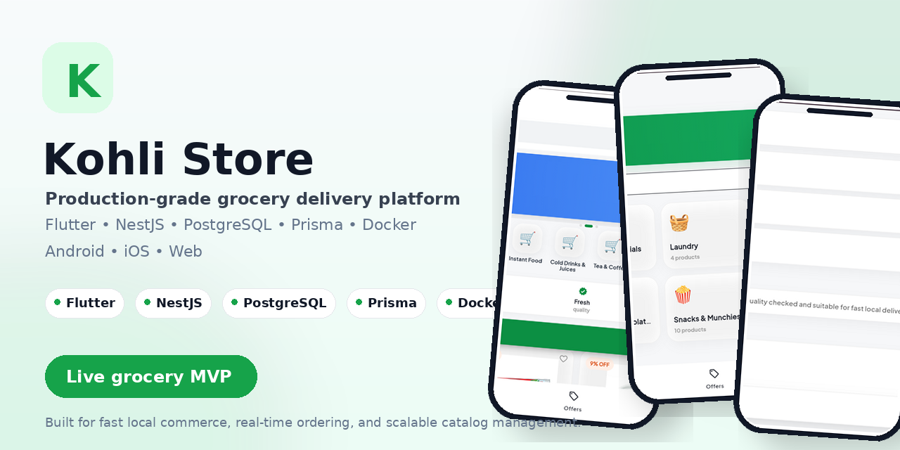
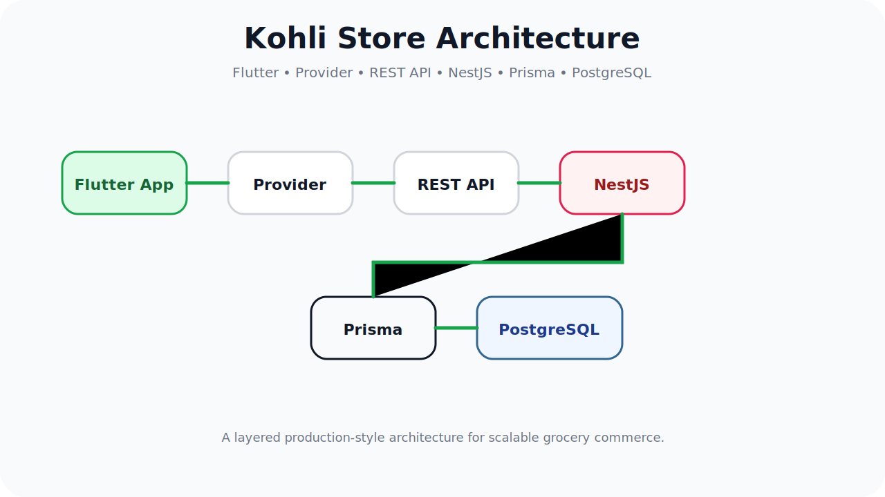
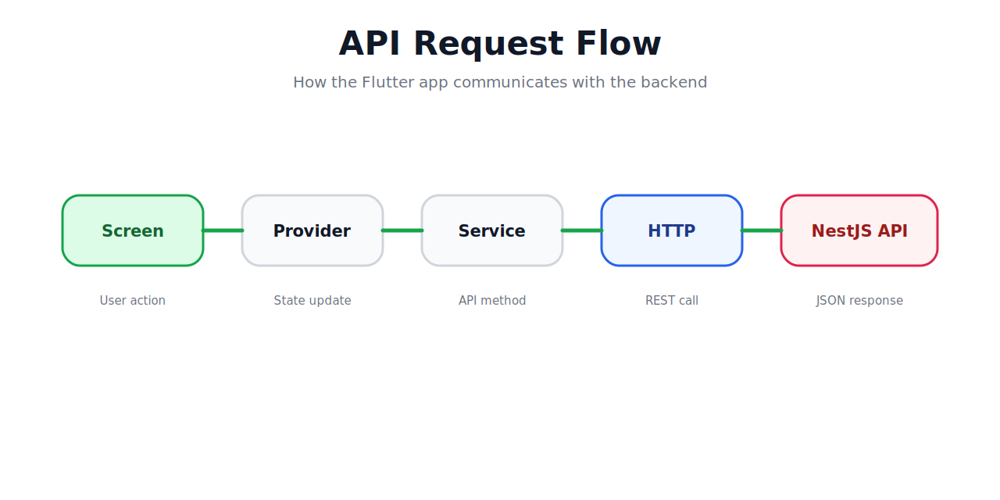

# 🛒 Kohli Store

> Production-ready grocery delivery platform built with **Flutter**, **NestJS**, **Prisma**, and **PostgreSQL**.

  

---

# 📱 Application Preview

| Home | Categories |
|------|------------|
|  |  |

| Product | Cart |
|---------|------|
|  |  |

---

# ✨ Features

- ✅ OTP Authentication
- ✅ Product Categories
- ✅ Product Search
- ✅ Product Details
- ✅ Shopping Cart
- ✅ Checkout Flow
- ✅ Offers
- ✅ User Profile
- ✅ Responsive Web
- ✅ Android Support
- ✅ Production Backend
- ✅ Docker Deployment

---

# 🛠 Tech Stack

| Layer | Technology |
|--------|------------|
| Mobile | Flutter |
| Backend | NestJS |
| Language | Dart + TypeScript |
| Database | PostgreSQL |
| ORM | Prisma |
| State Management | Provider |
| Deployment | Netlify + Render |

---
# ?? Architecture

The app uses a layered architecture separating UI, state management, API communication, backend services, ORM, and database storage.

# ?? API Flow

# ?? API Flow

